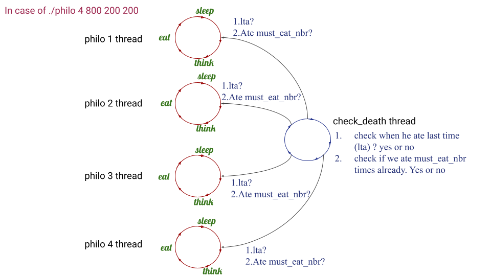

## Main threads explanation

## Useful links

 __*[pthread explanation video lesson playlist (there are 29 videos, watch 20 videos)](https://www.youtube.com/watch?v=d9s_d28yJq0&list=PLfqABt5AS4FmuQf70psXrsMLEDQXNkLq2&index=1)*__
 
 __*[Philosopher visualizer (you can understand more visually your output)](https://nafuka11.github.io/philosophers-visualizer/)*__
